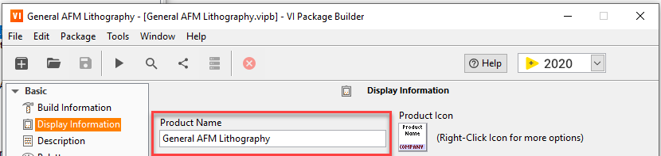
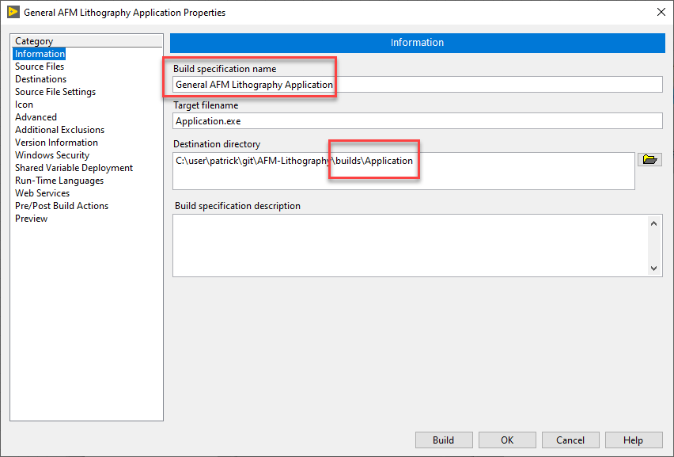
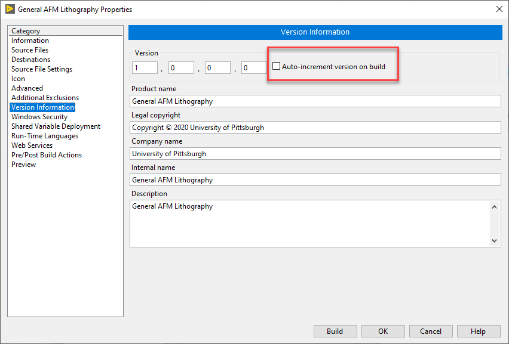
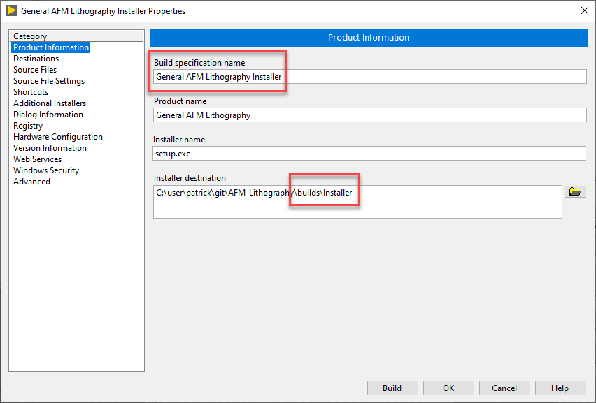
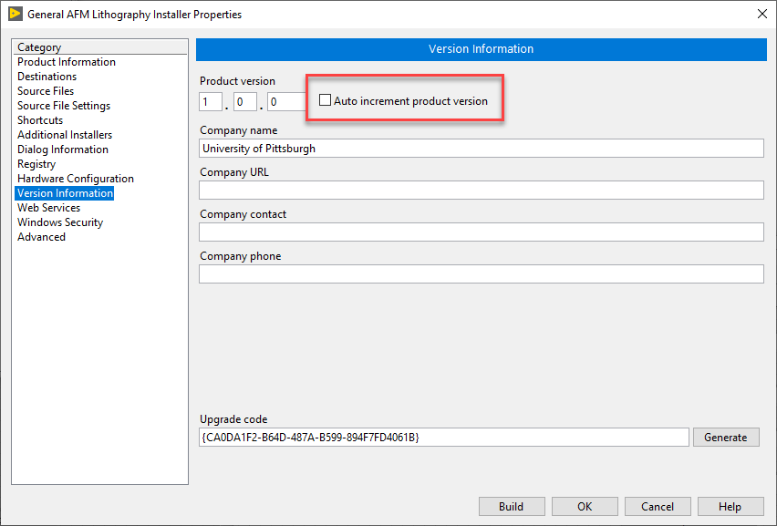

# build-support

LabVIEW VIs for supporting package and application builds. The package has two main features:
1. Build a self-extracting installer
2. Create a project from a template

## Installation & Requirements

Use VI Package Manager to install. The package is built using VIPM 2016. Manual building of a self-extracting installer has been tested with LabVIEW 2013 but automatic building is not supported.

## Usage

In all of the following example images the variable *Product Name* = General AFM Lithography

### Self-Extracting Installer

Use the Project Explorer to create two build specs: *Product Name* Application and *Product Name* Installer

#### *Product Name* Application
The output of the Application builder should be /builds/Application

Disable automatic version increment (the script will handle this)

#### *Product Name* Installer
The output of the Installer builder should be /builds/Installer

Disable automatic version increment (the script will handle this)

#### Manual build: Post Build Script (manual build).vi

After manually building the Application and Installer (right click > build) you can call this script to automate the creation of a self-extracting installer.

#### Auto build: Post Build Script (auto build).vi

It is recommended to manually build both the Application and Installer (right click > build) one time before trying automatic building via script methods.

**Post Build Script (auto build).vi** will programmatically build the applicataion, installer, and self-extracting installer. It can be called by **Post-Build Custom Action.vi** (called by VIPM during package build) to automate this sequence while building a VI package. There is a template in the /templates/ folder. 

### Project Setup

Experimental. Contact Patrick for assistance. 

## Contributing

Contact Patrick

## License
[BSD-3](https://choosealicense.com/licenses/bsd-3-clause/)
