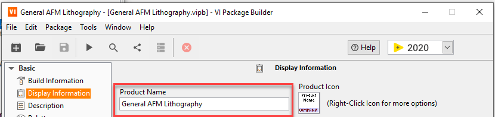
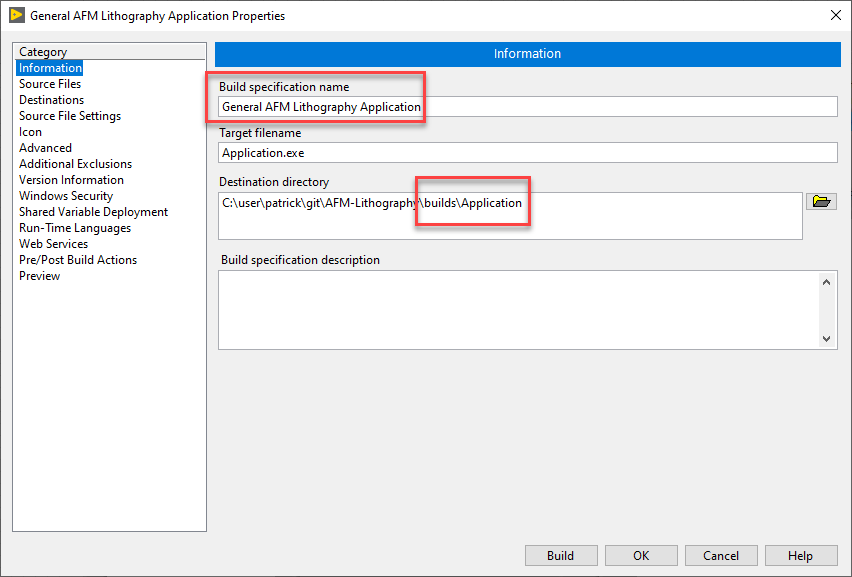
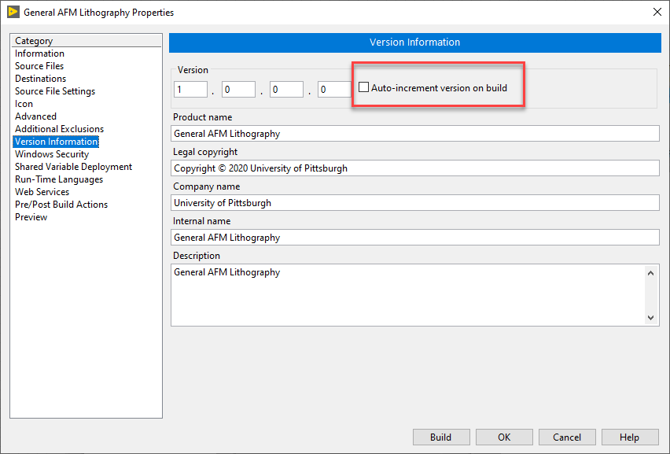
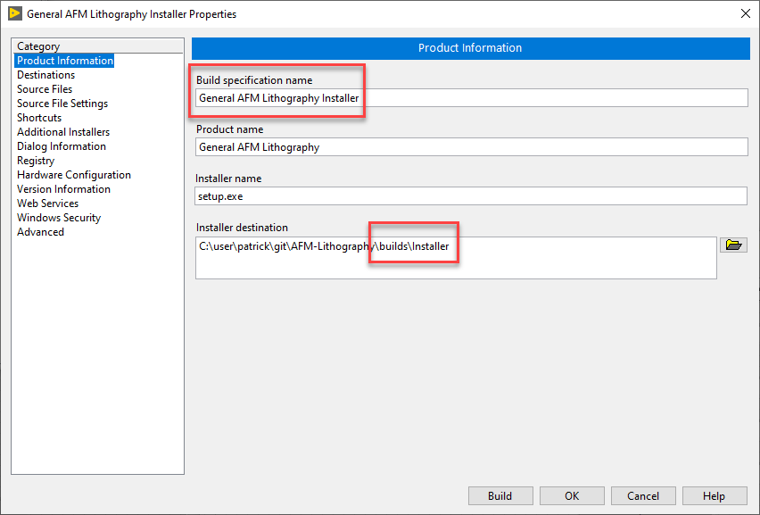
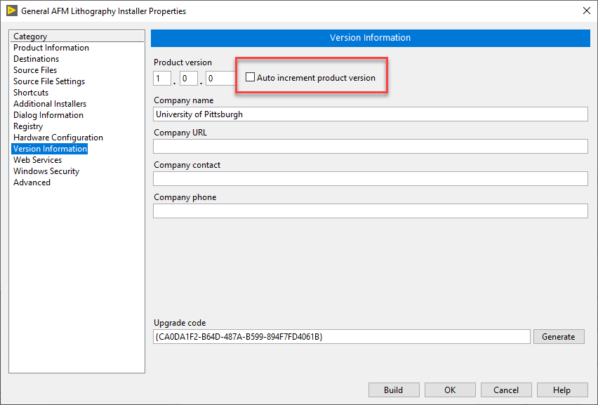

# build-support

LabVIEW VIs and scripts for building the lab's LabVIEW projects - producing VI packages (`.vip`) and Windows installers - plus creating projects from templates.

The build workflow (`build.bat`, `build.cfg`, and the Inno Setup installer) is documented in **[documentation/INNOSETUP.md](documentation/INNOSETUP.md)** - start there to build a repo.

## Installation & requirements

Install the package with VI Package Manager. Build machines also need Inno Setup 6.4+ and `CodeDependencies.iss`, both handled by `Setup-BuildMachine.bat` (see the build doc). Tested with LabVIEW 2019.

## Setting up a project's build specs

To build an installer, the project's `.lvproj` needs two build specs, by convention named *Product Name* Application and *Product Name* Installer. Put those spec names in the repo's `build support\build.cfg` (`APP_SPEC` / `INST_SPEC`).

In the following example images *Product Name* = General AFM Lithography.

### *Product Name* Application

Output to `/builds/Application`. Disable automatic version increment (the build handles versioning).

### *Product Name* Installer

Output to `/builds/Installer`. Disable automatic version increment.

## Building

See **[documentation/INNOSETUP.md](documentation/INNOSETUP.md)**: set the repo's `build support\build.cfg`, then run `build support\build.bat` - or `build_all.bat` to build a batch of repos in sequence.

## Project setup

Experimental. Contact Patrick for assistance.

## Contributing

Contact Patrick.

## License

[BSD-3](https://choosealicense.com/licenses/bsd-3-clause/)
